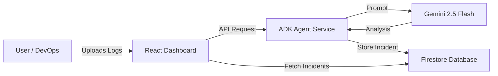

# Build an AI-Powered Incident Co-Pilot with Google Cloud & Gemini 2.5

Learn how to automate server log analysis and detect incidents in real-time using Generative AI.

## Introduction | Overview

**The Problem**: In modern DevOps, sifting through thousands of lines of server logs to find the root cause of an outage is like finding a needle in a haystack. It's time-consuming, error-prone, and stressful.

**The Solution**: In this guide, we will build an **AIOps Incident Co-Pilot**. This application uses Google's **Gemini 2.5 Flash** model to automatically analyze server logs, detect anomalies, identify root causes, and even suggest runbook steps for remediation.

**Target Audience**: DevOps Engineers, SREs, and Developers looking to integrate AI into their observability stack.

**Outcome**: By the end of this tutorial, you will have a fully deployed web application on Google Cloud Run that takes raw log files and turns them into actionable incident reports.

## Design

The solution follows a modern, serverless microservices architecture designed for scalability and ease of deployment.

### Architecture Diagram



### Key Components
1.  **Frontend (AIOps Dashboard)**: A responsive React application built with Vite and Tailwind CSS. It provides a clean interface for uploading logs and viewing incident details.
2.  **Backend (ADK Agent)**: A Python FastAPI service using the **Google AI Development Kit (ADK)**. It acts as the bridge between the user and the AI model.
3.  **AI Model (Gemini 2.5 Flash)**: We chose the "Flash" variant for its speed and cost-effectiveness, which is critical for processing large volumes of log data quickly.
4.  **Database (Firestore)**: A NoSQL document store used to persist incident reports, making them accessible for historical analysis.
5.  **Compute (Cloud Run)**: Both the frontend and backend are containerized and deployed on Cloud Run, ensuring they scale to zero when not in use.

## Prerequisites

Before you begin, ensure you have the following:

*   **Google Cloud Account**: With billing enabled.
*   **Google Cloud SDK**: Installed and authenticated (`gcloud auth login`).
*   **Git**: For version control.
*   **Node.js (v18+) & Python (v3.11+)**: For local development (optional, as we can deploy via Cloud Shell).
*   **Basic Knowledge**: Familiarity with Docker and REST APIs is helpful.

## Step-by-step Instructions

### 1. Clone the Repository
Start by getting the code. We have prepared a starter repository with the necessary scaffolding.

```bash
git clone https://github.com/your-username/aiops-copilot.git
cd aiops-copilot
```

### 2. Configure the Backend (ADK Agent)
The agent is the brain of our operation. It needs to be containerized to run on the cloud.

*   **Review `server.py`**: This file sets up the FastAPI server and defines the `/analyze` endpoint. It constructs a prompt for Gemini that includes the log data and asks for a structured JSON response.
*   **Dockerfile**: We use a lightweight `python:3.11-slim` image.

```dockerfile
# adk-agent/Dockerfile
FROM python:3.11-slim
ENV PYTHONUNBUFFERED=1
WORKDIR /app
COPY . .
RUN pip install --no-cache-dir .
CMD ["python", "server.py"]
```

### 3. Deploy to Google Cloud Run
We have streamlined the deployment process into a single script. This script enables the required APIs (Cloud Run, Firestore, Vertex AI), builds the containers, and deploys them.

Run the following command in your terminal (or Cloud Shell):

```bash
chmod +x deploy.sh
./deploy.sh
```

**What happens here?**
*   APIs are enabled.
*   A Firestore database is created.
*   The `adk-agent` is built and deployed to Cloud Run.
*   The `aiops-dashboard` is built and deployed, with the Agent's URL injected as an environment variable.

### 4. Access the Dashboard
Once the deployment finishes, the script will output your Dashboard URL.

```text
🎯 Your AIOps Dashboard is live at:
   https://aiops-dashboard-xyz-uc.a.run.app
```

Click the link to open your new tool!

## Result / Demo

You now have a live AIOps environment. Let's test it.

1.  **Navigate to the "Paste Text" tab** on the dashboard.
2.  **Paste sample logs**:
    ```text
    192.168.1.104, 2025-11-24 10:15:03, /api/checkout, 500
    192.168.1.104, 2025-11-24 10:15:04, /api/checkout, 500
    192.168.1.104, 2025-11-24 10:15:05, /api/checkout, 500
    ```
3.  **Click "Analyze"**.

### The Outcome
Within seconds, you will see a new **Incident Card** appear.

*   **Severity**: High (Red)
*   **Summary**: Checkout Service Failure
*   **Root Cause**: Repeated 500 Internal Server Errors indicating a crash in the checkout microservice.
*   **Remediation**: The AI will suggest steps like "Check application logs for stack traces" or "Restart the checkout service pod."

This visualization transforms raw, hard-to-read text into immediate, actionable intelligence.

## Challenges & Learnings
During the development of this project, we encountered several interesting challenges that provided valuable learning opportunities:

1.  **Cloud Run Container Startup**: We initially faced issues where the container failed to start because the `PORT` environment variable wasn't being correctly passed to the application. We resolved this by ensuring our Dockerfile `CMD` instruction explicitly used the `${PORT}` variable.

2.  **ADK Auto-Discovery**: The Google AI Development Kit (ADK) has a feature to auto-discover agents, but it relies on strict package naming conventions. We encountered `ModuleNotFoundError` because our package name in `pyproject.toml` didn't match the directory structure expected by the auto-discovery tool. We fixed this by bypassing the auto-discovery wrapper and initializing the `FastAPI` app directly, giving us more control.

3.  **Dependency Management**: We faced `ImportError` issues with `VertexAI` due to version differences in the `google-adk` library between our local environment and the container. We implemented a robust import strategy in our `agent.py` that tries multiple known import paths (`google.adk.models.VertexAI`, `google.adk.models.vertex_ai.VertexAI`, etc.) to ensure compatibility across different versions.

4.  **Error Visibility**: Initial 502 errors were hard to debug because they were generic. We learned the importance of robust error logging in the backend to capture specific initialization failures (like missing credentials or import errors) and return meaningful HTTP error codes (503 vs 500) to the frontend.

## What’s next?

You've built a powerful prototype, but this is just the beginning. Here are some ways to extend this project:

*   **Real-time Streaming**: Connect the agent to a Pub/Sub topic to analyze logs as they flow in real-time.
*   **Human-in-the-Loop**: Add a "Feedback" button to the dashboard to let users correct the AI, fine-tuning the model over time.
*   **Slack Integration**: sending alerts directly to your team's communication channel when a high-severity incident is detected.

---
*Built with ❤️ using Google Cloud and Gemini.*
